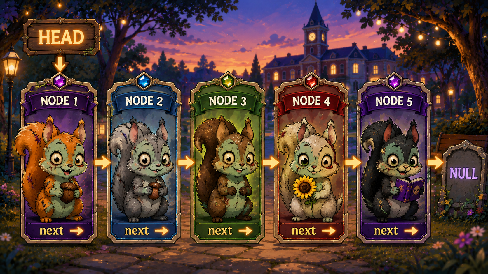

# 🔗 Linked Lists: Why, What, and How

Linked Lists are a way of organizing data by connecting individual **Nodes** together.

Think of it as a chain:

```text
HEAD → NODE → NODE → NODE → null
```

---

## ❓ WHY Would We Use a Linked List?

A **Linked List** is useful for storing a collection of data where Nodes can be added or removed by changing the references that connect them.

Unlike an array, a Linked List does not rely on numbered indexes to access its Nodes.

### The Tradeoff

Because there are no indexes, we cannot simply jump directly to a Node.

Instead, we may have to travel through the list:

```text
HEAD → NODE 1 → NODE 2 → NODE 3 → NODE 4 → null
```

> We move through a Linked List **one Node at a time**.

---

## 🔍 WHAT Is a Linked List?

A **Linked List** is a data structure made of connected **Nodes**.

Each Node contains two important pieces of information:

| Part | Purpose |
| --- | --- |
| **value** | Stores the Node's data |
| **`next`** | References the next Node |

The **Head** tells us where the Linked List begins.

The final Node's `next` points to **`null`**, telling us that we have reached the end.

### Basic Structure

```text
HEAD
 ↓
[A | next] → [B | next] → [C | null]
```

---

# 🐿️ Zombie Squirrel Linked List

To make the idea easier to visualize, imagine a chain of **zombie squirrels**.

In the story analogy, each zombie squirrel infects one squirrel after it, creating a chain.

The **infection explains the story**.

The **`next` pointer explains the data structure**.



### What Does the Picture Represent?

| Zombie Squirrel Story | Linked List |
| --- | --- |
| 🐿️ Zombie Squirrel | **Node** |
| First squirrel | **Head** |
| Connection to the next squirrel | **`next` pointer** |
| End of the chain | **`null`** |

The actual Linked List represented by the squirrels is:

```text
HEAD
 ↓
NODE 1
 ↓ next
NODE 2
 ↓ next
NODE 3
 ↓ next
NODE 4
 ↓ next
NODE 5
 ↓ next
null
```

> **Important:** `next` is a reference to the next Node. The infection is only the story used to explain why the squirrels form a chain.

---

## 🚶 HOW Do We Move Through a Linked List?

Moving through a Linked List is called **traversal**.

We begin at the **Head** and repeatedly follow `next`.

Suppose we are looking for `C`:

```text
HEAD
 ↓
 A → B → C → null
```

The computer checks:

```text
A → Is this C? No.
B → Is this C? No.
C → Is this C? Yes!
```

Because we may have to check every Node, searching or traversing a Linked List has a worst-case time complexity of:

### **O(n)**

The amount of work can grow with the number of Nodes.

---

## ⚡ What About Adding a Node?

Adding a new Node at the **Head** can be:

### **O(1)**

For example:

```text
BEFORE

HEAD
 ↓
 A → B → C → null


ADD X

HEAD
 ↓
 X → A → B → C → null
```

We do not need to travel through `A`, `B`, and `C`.

We only need to change the references at the beginning of the list.

---

## 📈 Big O and Linked Lists

The operation we perform determines the Big O complexity.

| Operation | Big O | Why? |
| --- | --- | --- |
| Access the Head | **O(1)** | Head is already known |
| Insert at Head | **O(1)** | No traversal required |
| Traverse the list | **O(n)** | May visit every Node |
| Search for a value | **O(n)** | May check every Node |

---

## 🧠 Simple Way to Remember

> ### **HEAD → Read → Follow `next` → Repeat → `null`**

Or:

```text
START
  ↓
HEAD
  ↓
Read Node
  ↓
Follow next
  ↓
Read Node
  ↓
Follow next
  ↓
null
  ↓
STOP
```

**Head starts the journey. `next` keeps it moving. `null` tells us to stop.**